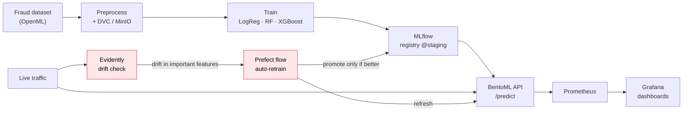
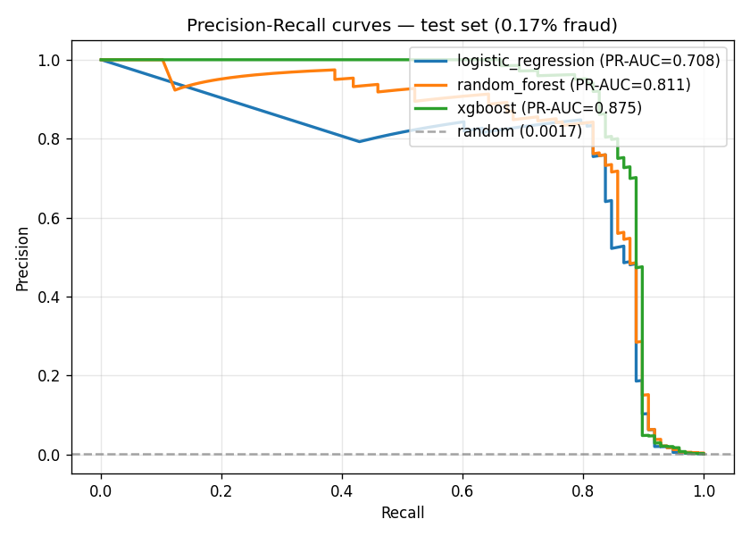
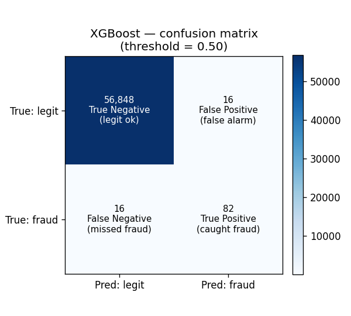
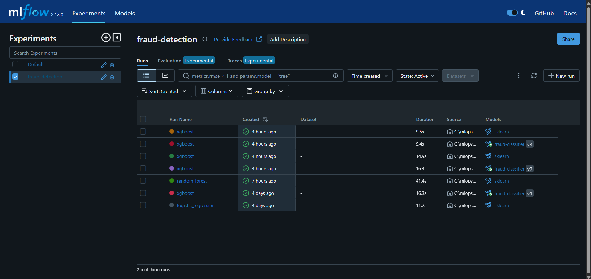
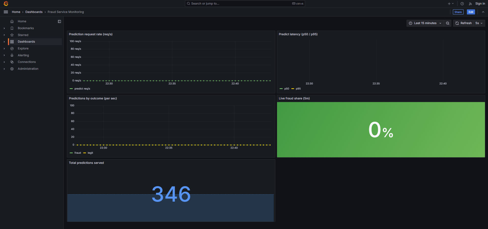
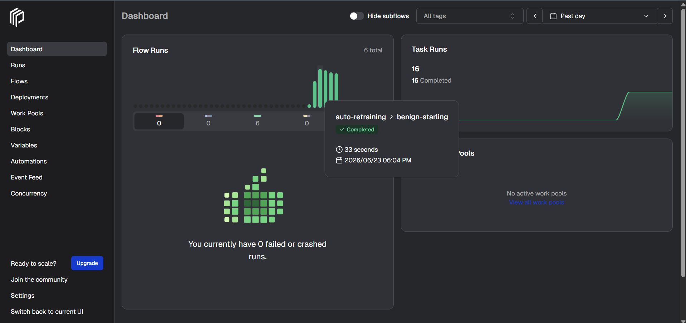
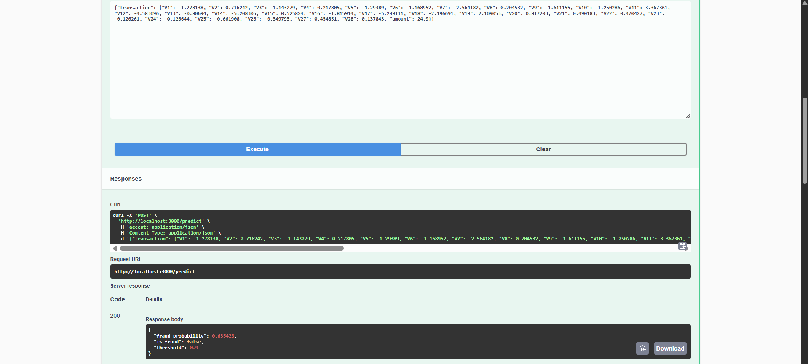

# MLOps Pipeline — Credit Card Fraud Detection

[](https://github.com/Kaushik1128/mlops-pipeline/actions/workflows/ci.yml)


> A production-shaped MLOps system that trains a fraud model, serves it as a
> REST API, watches it for data drift, and **automatically retrains and
> redeploys itself** when the world changes — all observable on live
> dashboards. Built end-to-end on a free, local, Docker-based stack.

The interesting part of machine learning in production isn't training a model —
it's everything *around* it. Models decay silently: a fraud detector trained on
yesterday's patterns quietly goes wrong as fraudsters adapt, while still
returning confident predictions. This project is the system that **detects that
decay and heals itself**.

---

## Architecture



**The self-healing loop (red):** live traffic is checked for drift; if features
the model *relies on* have drifted, a Prefect flow retrains, evaluates the
candidate against the incumbent, promotes it **only if it's better**, and
refreshes the serving API — with no human in the loop.

---

## Why this project

A model in a notebook is worth nothing to a business — fraud happens 24/7 in
milliseconds. And a deployed model isn't "done": it **decays**. During early
COVID, spending patterns shifted overnight and fraud models trained on
pre-pandemic data started blocking normal purchases and missing new fraud. The
teams that survived had **drift monitoring and automated retraining** — exactly
what this project implements.

So this repo is deliberately about the hard 90% of real ML work: reproducible
data and experiments, a governed model registry, a validated serving API, drift
detection, automated retraining with a promotion gate, and live observability.

---

## Results

Three models compared on a held-out test set. The dataset is **extremely
imbalanced** (0.17% fraud), so the headline metric is **PR-AUC**, not accuracy
or ROC-AUC (which look great but are misleading under imbalance).

| Model | PR-AUC | ROC-AUC | Precision | Recall |
|---|---|---|---|---|
| Logistic Regression (baseline) | 0.708 | 0.971 | 0.058 | 0.918 |
| Random Forest | 0.811 | **0.982** | 0.808 | 0.816 |
| **XGBoost** (promoted to `@staging`) | **0.875** | 0.976 | 0.837 | 0.837 |

XGBoost lifts PR-AUC by +0.17 over the baseline and precision from 6% → 84%,
while ROC-AUC barely moves — a concrete demonstration of why ROC-AUC misleads
under heavy class imbalance. (Note Random Forest has the *highest* ROC-AUC yet
ranks 2nd on PR-AUC — the trap, illustrated.)

| Precision-Recall curves | XGBoost confusion matrix |
|---|---|
|  |  |

*(Regenerate with `python -m src.models.plot_results`.)*

---

## Screenshots

> Capture each from the running stack, save into `assets/screenshots/` with the
> filename below, then uncomment the embed block under the table.


| MLflow — experiments & registry | Grafana — live dashboard |
|---|---|
|  |  |
| Prefect — auto-retraining flow | BentoML — Swagger API |
|  |  |

---

## How it works (the MLOps lifecycle)

1. **Data** — the fraud dataset is downloaded, explored (EDA), preprocessed
   with a stratified split, and **versioned with DVC** (pointers in Git, bytes
   in MinIO). Reproducibility is verified: wipe local data, `dvc pull`, hashes
   match.
2. **Train & track** — a config-driven trainer fits multiple models, logging
   every run to **MLflow** (params, metrics, the git SHA + data hash for full
   lineage, the model artifact, and a confusion-matrix plot).
3. **Register & promote** — the best model by PR-AUC is registered in the
   **MLflow Model Registry** and aliased `@staging`. Serving loads the alias, so
   promoting a new model needs no serving-code change.
4. **Serve** — a containerized **BentoML** service imports `@staging` at startup
   and exposes a Pydantic-validated `/predict` endpoint with auto-generated
   Swagger docs. The decision threshold is a deploy-time env var.
5. **Detect drift** — **Evidently** compares a current batch against the
   training reference per-feature (Wasserstein distance). Drift is
   **importance-weighted** — it fires on features the model relies on, not on
   noise in features it ignores (an analogue of `scale_pos_weight`).
6. **Auto-retrain** — a **Prefect** flow ties it together: drift check → retrain
   → evaluate vs incumbent → **promote only on a real improvement** → refresh
   serving. Runs on a cron schedule.
7. **Observe** — the API is instrumented with **Prometheus** metrics (request
   rate, latency percentiles, and a custom fraud-rate counter), visualized on a
   provisioned **Grafana** dashboard.

---

## Tech stack

| Layer | Tool | Why |
|---|---|---|
| Infrastructure | Docker Compose | One command brings up the whole 7-service stack |
| Object storage | MinIO (S3-compatible) | Real S3 API locally; same code works on AWS |
| Data versioning | DVC | Git-for-data — version datasets without bloating Git |
| Experiment tracking + registry | MLflow | Compare runs, govern model promotion with lineage |
| Modeling | Scikit-learn, XGBoost | Strong tabular baselines; XGBoost handles imbalance |
| Model serving | BentoML | Model → validated REST API + container, minimal boilerplate |
| Drift detection | Evidently AI | Statistical per-feature drift, reports + signal |
| Orchestration | Prefect | Scheduled, retried, observable flows (not brittle cron) |
| Metrics DB | Prometheus | Pull-based time-series, the de-facto standard |
| Dashboards | Grafana | Live visualization of system + business metrics |
| Metadata DB | PostgreSQL | MLflow's backing store |

---

## Quickstart

```bash
# 1. Configure secrets
cp .env.example .env            # then edit the passwords

# 2. Bring up the full stack (7 services)
docker compose up -d

# 3. Create a Python env for the pipeline code
python -m venv .venv
.venv\Scripts\Activate.ps1       # Windows PowerShell
pip install -r requirements.txt

# 4. Data: download, preprocess, version
python -m src.data.download
python -m src.data.preprocess
dvc push

# 5. Train, evaluate, register the best model
python -m src.models.train --model xgboost
python -m src.models.register

# 6. Drift check + auto-retraining flow
python -m src.monitoring.check_drift --current data/processed/test_drifted.parquet
python -m src.flows.retraining_flow --current data/processed/test_drifted.parquet

# 7. Drive traffic and watch the Grafana dashboard
python -m src.serving.generate_traffic
```

### Service UIs

| Service | URL |
|---|---|
| **Fraud API + Swagger docs** | http://localhost:3000 |
| **Grafana dashboards** | http://localhost:3001 |
| MLflow (experiments + registry) | http://localhost:5000 |
| Prefect (orchestration) | http://localhost:4200 |
| MinIO console (object storage) | http://localhost:9001 |
| Prometheus (metrics) | http://localhost:9090 |

---

## Repository structure

```
configs/             Training config (hyperparameters, paths)
data/                DVC-tracked datasets (raw + processed)
docker/              Custom Dockerfiles (MLflow image, serving image)
infrastructure/      Prometheus scrape config + Grafana dashboards (as code)
notebooks/           Exploratory data analysis
src/data/            Download + preprocessing
src/models/          Training, evaluation, registry
src/serving/         BentoML service, model import, traffic generator
src/monitoring/      Drift simulation + detection (Evidently)
src/flows/           Prefect auto-retraining flow
docker-compose.yml   The full 7-service stack
docs/DEMO.md         Click-by-click demo walkthrough
```

---

## Engineering highlights

- **Reproducibility everywhere** — every MLflow run is tagged with its git SHA
  and DVC data hash, so any result is traceable to exact code + exact data.
- **Right metric for the problem** — PR-AUC over ROC-AUC under 0.17% imbalance,
  demonstrated three times across the model comparison.
- **Governance gate** — auto-retraining promotes a new model *only* if it beats
  the incumbent by a margin; it can never displace a known-good model on noise.
- **Importance-weighted drift** — drift is weighted by model feature importance,
  so retraining triggers on dangerous drift and ignores harmless noise.
- **Dependency isolation** — the serving layer is containerized partly because
  BentoML and Prefect have conflicting dependencies; isolating it is the fix.
- **Train/serve skew avoided** — preprocessing (scaling in-pipeline, log1p at
  serve time) is replicated exactly so the model never sees inputs it didn't
  train on.
- **Tested + CI** — pure-function modules (metrics, pipeline construction, drift
  parsing, sampling) have a pytest suite run on every push via GitHub Actions
  (`pip install -r requirements-test.txt && pytest`).

---

> Built as a learning-focused portfolio project. Code favours clarity and
> documented decisions over cleverness. See `docs/DEMO.md` for a guided
> walkthrough.
